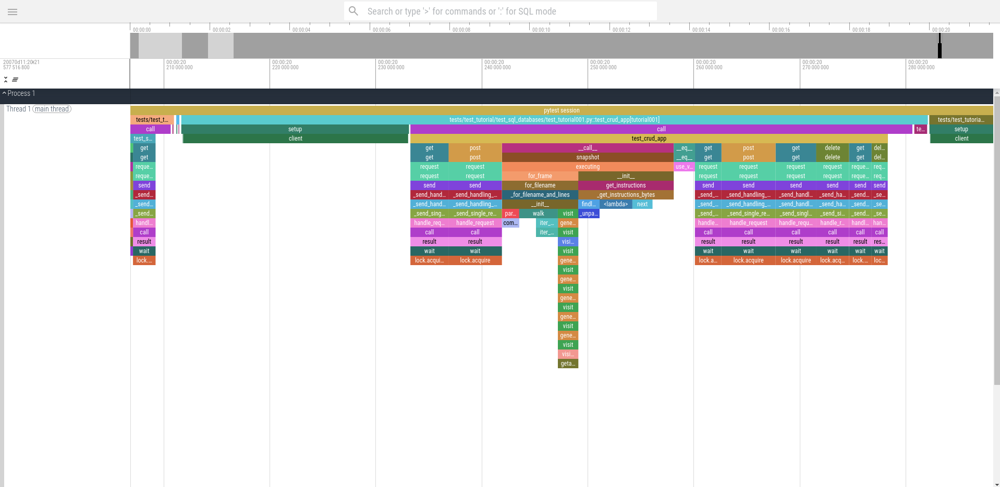

# ☠️ Perfsephone, the pytest embedded profiler.
Perfsephone is a pytest plugin that profiles tests running under pytest, whose results can be
visualized using the [perfetto UI](https://perfetto.dev/), or chrome's builtin trace visualizer
[about:tracing](about:tracing).

Perfsephone integrates well with CI/CD pipelines by generating json files which may be consumed at a
later time.


*A perfsephone generated trace file of FastAPI's test suite, visualized using ui.perfetto.dev*

# Getting started
## Installation
### pip
```bash
pip install git+https://github.com/lucamuscat/perfsephone.git
```

## Generating a trace
In order to generate a trace using perfsephone, add the `--perfetto=<FILE PATH>` flag to your pytest
invocation:

`pytest --perfetto=./trace.json`

# Motivation
Although profiling tools for python already exist, they either:
* Do not integrate well with pytest, leaving out essential data, such as time spent in test setup,
test teardown, and collection time;
* Generate too much cruft. Perfsephone filters out call stacks related to pytest internals, which
  cannot be optimized without optimizing pytest itself.